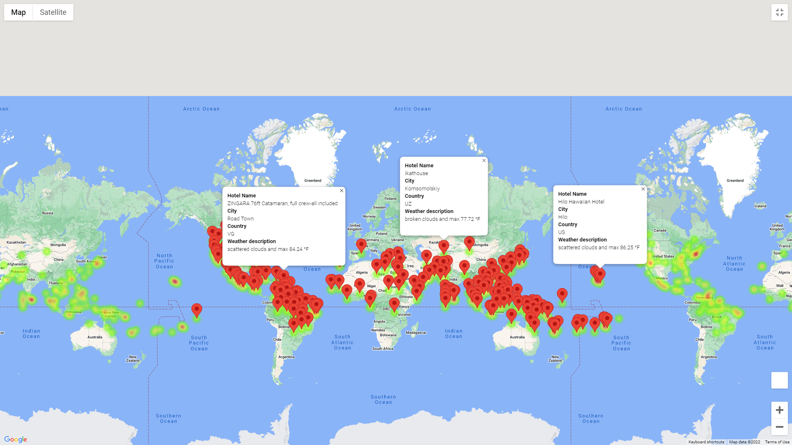
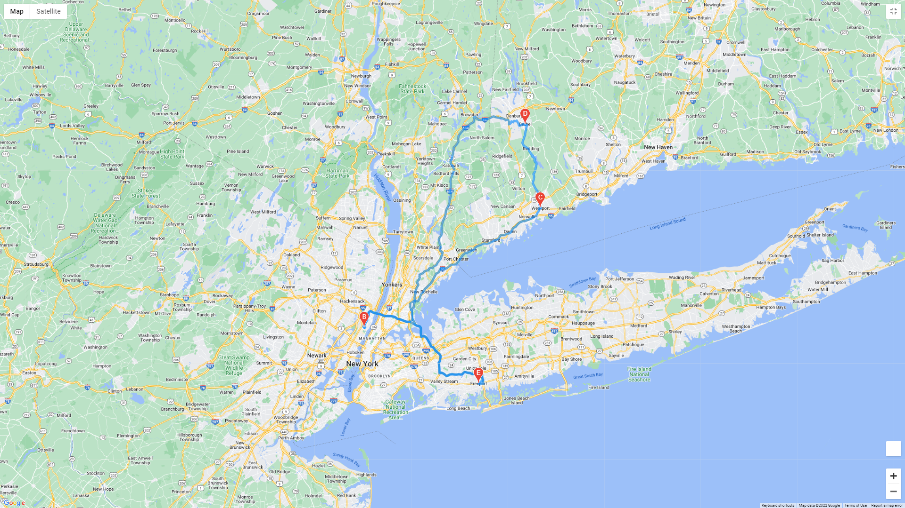
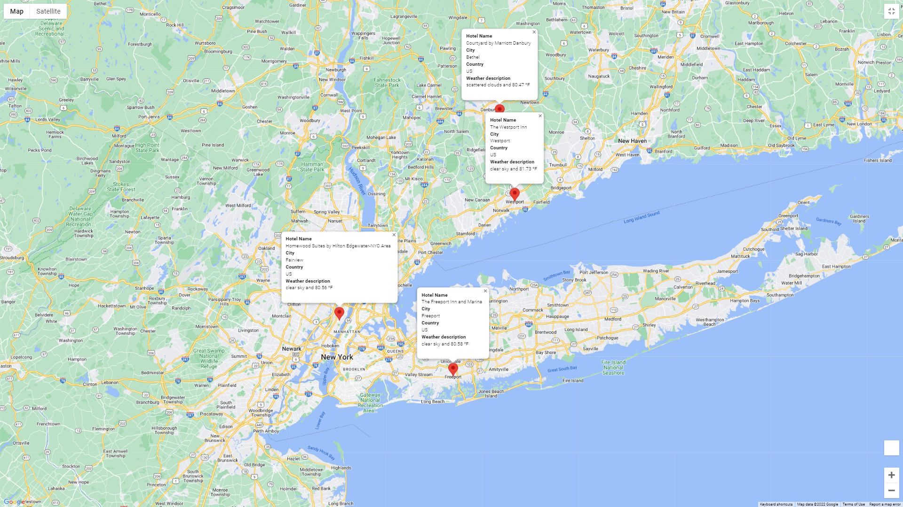

# World_Weather_Analysis
## Overview
Make recommended changes to take PlanMyTrip app to the next level. 
## Results

### Added the weather description to the collected weather data for a more informative user interface.

### Incorporated input statements to filter the data for the user's temperature preferences. These inputs were then used to identify potential destinations and nearby lodgings. 

https://github.com/Jrheldmann/World_Weather_Analysis/blob/main/Vacation_Search/Vacation_Search.ipynb

### As a test, four cities were chosen to create a travel itinerary. The Google Maps Directions API was then used create a travel route between those four cities and a marker layer map.

The test came back successful.

## Conclusion
The PlanMyTrip app has accomplished it's short-term goal of implementing suggested changes by beta testers, it's journey toward becoming the #1 recommended Map application is one step shorter! The more data that is acquired from APIs, the more avenues open up for improvement.
